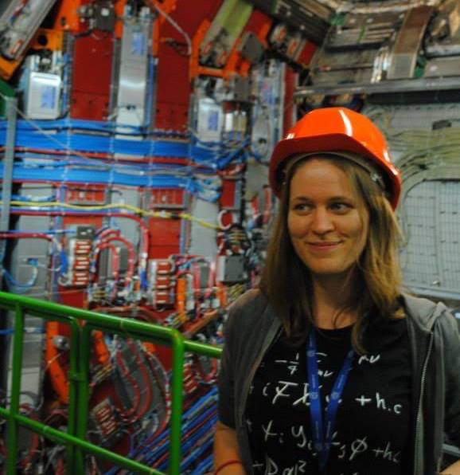
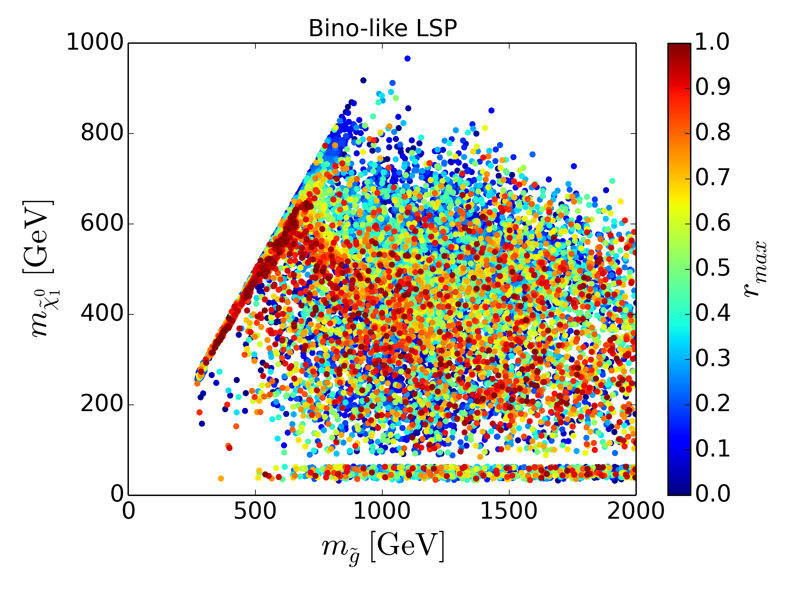
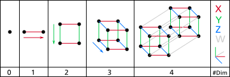
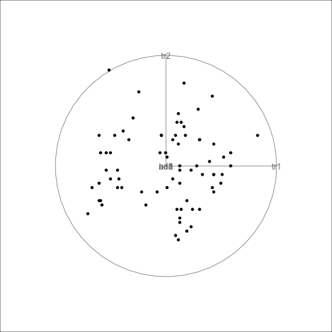
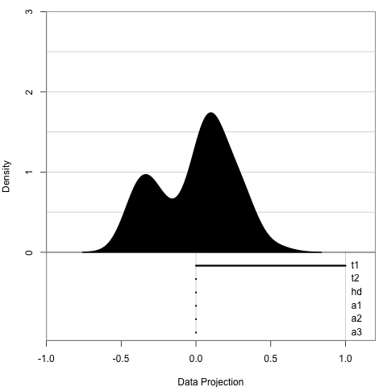
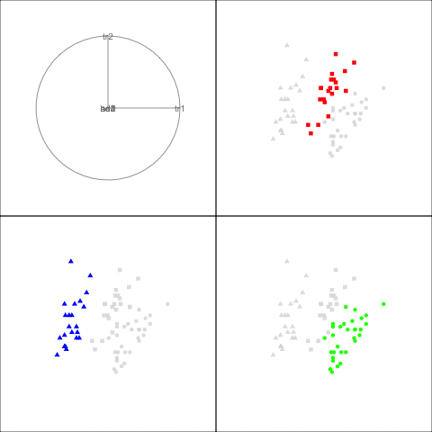

layout: false
class: split-33 with-thick-border border-black


```{css, echo=FALSE}
/* custom.css */
:root{
  --main-color1: #2f4c7a;
  --main-color2: #bcbddc;
  --main-color3: #efedf5;
  --main-color4: #9DDAE5;
  --text-color3: black;
  --text-color4: black;
  --code-inline-color: #4e5054;
  --link-color: #006CAB;
  --logo: url(http://www.fragiletoagile.com.au/wp-content/uploads/2018/02/monash-university-logo-transparent.png);
}
.large { font-size: 150% }
.largeish { font-size: 120% }
.summarystyle { font-size: 150%;
  line-height:150%;}
```


```{r setup, include=FALSE}
options(htmltools.dir.version = FALSE, width = 120)
library(tidyverse)
library(knitr)
library(kableExtra)
library(htmltools)
library(icon)
opts_chunk$set(
  echo = FALSE, warning = FALSE, message = FALSE, comment = "#>",
  fig.path = 'figure/', cache.path = 'cache/', fig.align = 'center',
  fig.width = 12, fig.height = 4, fig.show = 'hold',
  cache = TRUE, external = TRUE, dev = 'png', dev.args = list(bg = "transparent")
)
mp4_vid <- function(src, width){
  HTML(
    paste0(
      '<video width="', width, '" loop autoplay>
        <source src="', src, '" type="video/mp4">
      </video>'
    )
  )
}
```

.column[.bottom_abs.content[

]]

.column.bg-main1[.content.vmiddle[.center[


# High-dimensional data visualisation with tours

<br>
<br>

# Ursula Laa


### School of Physics and Astronomy
### &
### Department of Econometrics and Business Statistics

]]]
---
layout: false
class: split-66

.column[.content[


# A bit about me

<br>

```{r map1, fig.height=6}
world_map <- map_data("world")
ggplot(world_map, aes(x = long, y = lat, group = group)) +
  geom_polygon(fill="lightgray", colour = "white") +
  geom_polygon(fill="red", data = filter(world_map, region == "Austria")) +
  theme_void()
```
]]

.column[.content.vmiddle[.center[


<br>


]]]

---
layout: false
class: split-66

.column[.content[


# A bit about me

<br>

```{r map2, fig.height=6}
world_map <- map_data("world")
ggplot(world_map, aes(x = long, y = lat, group = group)) +
  geom_polygon(fill="lightgray", colour = "white") +
  geom_polygon(fill="red", data = filter(world_map, region == "France")) +
  theme_void()
```
]]

.column[.content.vmiddle[.center[


<br>


]]]

---
layout: false
class: split-66

.column[.content[


# A bit about me

<br>

```{r map3, fig.height=6}
world_map <- map_data("world")
ggplot(world_map, aes(x = long, y = lat, group = group)) +
  geom_polygon(fill="lightgray", colour = "white") +
  geom_polygon(fill="red", data = filter(world_map, region == "Australia")) +
  theme_void()
```
]]

.column[.content.vmiddle[.center[


<br>


```{r, out.width='60%', out.height='60%', autoplay=FALSE}
knitr::include_graphics("plots/flyingBirds.gif")
```
]]]

---
class: middle center bg-main1

# Projections

---

## Projections are everywhere

<br>

--

.large[The most common projections are from our **3 dimensional** world onto a **2 dimensional** plane]

--

<br>

.large[Examples:
* Photographs
* 3D objects on 2D screens
* Shadows
]

--

<br>

.large[We can fully understand the 3D object if we look at it from different angles, for example when we rotate the viewing angle of a 3D plot!]

---
# We can understand the 3D shape from 2D  projections

<br>
<br>

.center[
```{r}
mp4_vid("plots/media.io_cube-3.mp4", 450)
```
]

<br>

Example video taken from [here](http://schloerke.com/geozoo/)
---
class: middle center

# Looking at 3D plots

<br>

```{r plotly3d, echo=FALSE, out.width='60%', out.height='60%', }
library(plotly)

mtcars$am[which(mtcars$am == 0)] <- 'Automatic'
mtcars$am[which(mtcars$am == 1)] <- 'Manual'
mtcars$am <- as.factor(mtcars$am)

plot_ly(mtcars, x = ~wt, y = ~hp, z = ~qsec, color = ~am, colors = c('#BF382A', '#0C4B8E')) %>%
  add_markers() %>%
  layout(scene = list(xaxis = list(title = 'Weight'),
                     yaxis = list(title = 'Gross horsepower'),
                     zaxis = list(title = '1/4 mile time')))
```

<br>

.largeish[This is an example from [plotly](https://plot.ly/r/3d-scatter-plots/)]

---
class: middle center bg-main1

# Beyond 3 dimensions
---

# Going to 4 dimensions

<br>

--

.center[ <br> from [here](https://en.wikipedia.org/wiki/File:Dimension_levels.svg)]

<br>

--

.large[We can imagine a 4D cube by extending a 3D cube into a 4th dimension. That is also how we think about high dimensions in data, each dimension adds an orthogonal axis.]

--

.large[And we can look at different 2D views with a grand tour. Each plane corresponds to a **projection** from the original space down to two dimensions, and we project each data point onto the same plane.]

---

# Grand tour showing a 4D cube

<br>
<br>

.center[
```{r}
mp4_vid("plots/media.io_cube-4.mp4", 450)
```
]

<br>

Example videos taken from [here](http://schloerke.com/geozoo/)

---

# Grand tour showing a 5D cube

<br>
<br>

.center[
```{r}
mp4_vid("plots/cube-5.mov", 450)
```
]

<br>

.large[This works for any number of dimensions and we can learn about the shape in the high dimensional space.]

---

# Shapes in 5D

.largeish[Comparing samples on the surface of a sphere vs the faces of a cube in 5D. We can understand differences between the shapes through the interpolated 2D projections!]

```{r eval=FALSE, echo=FALSE, warning=FALSE}
# source: https://github.com/dicook/UMelb_Econ/blob/master/index.Rmd
library(geozoo)
library(tourr)
s5 <- sphere.hollow(p=5)$points[1:500,]
colnames(s5) <- paste0("V", 1:5)
c5 <- cube.face(p = 5)
c5 <- c5$points[sample(1:nrow(c5$points), 500),]
c5 <- (c5 - 0.5) * 1.4
colnames(c5) <- paste0("V", 1:5)
bases <- save_history(c5, grand_tour(2),
                      max = 5)
tour_path <- interpolate(bases, 0.1)
d <- dim(tour_path)
mydat <- NULL
for (i in 1:d[3]) {
  #cat(i, "\n")
  s5p <- s5 %*% matrix(tour_path[,,i], ncol=2)
  s5p <- cbind(s5p, rep("sphere", 500))
  colnames(s5p) <- c("x", "y", "shape")
  c5p <- c5 %*% matrix(tour_path[,,i], ncol=2)
  c5p <- cbind(c5p, rep("cube", 500))
  colnames(c5p) <- c("x", "y", "shape")
  s5c5 <- rbind(s5p, c5p)
  mydat <- rbind(mydat, cbind(s5c5, rep(i+10, 2*nrow(s5p))))
}
colnames(mydat)[4] <- "indx"
df <- as.tibble(mydat)
df$x <- as.numeric(df$x)
df$y <- as.numeric(df$y)
#save(df, file="data/s5_t.rda")
library(plotly)
#load("data/s5_t.rda")
p <- ggplot(data = df, aes(x = x, y = y) ) +
       geom_point(aes(frame = indx), size=0.5) +
       facet_wrap(~shape) +
       theme_void() +
       coord_fixed()
pg <- ggplotly(p, width=600, height=400) %>%
  animation_opts(200, redraw = FALSE, 
                 easing = "linear", transition=0)
save_html(pg, file="s5.html")
```

--

.center[
<iframe src="s5.html" width="800" height="500" scrolling="yes" seamless="seamless" frameBorder="0"> </iframe>
]

---
class: middle center bg-main1

# Grand tour data displays

---

# 2D scatter plot display

.large[
* All data points are projected onto 2D plane
* Draw scatter plot of the data points
* Represent the current projection as "axes"
]

.center[
```{r, out.width='40%', out.height='40%'}

```
]
---
class: split-two

.column[.content[
# Many other dispay types are possible

.large[Example displays for 1 or 3 dimensional projections]

```{r, out.width='70%', out.height='70%'}

```
]]

.column.column[.content.vmiddle[
```{r, out.width='70%', out.height='70%'}
knitr::include_graphics("tour3d.gif")
```
]]

---
class: middle center bg-main1

# Using tours in (physics) research

---
class: split-two

.column[.content[
# Exploring structure in high dimensions

<br>

.large[Tour visualisations are a great way to explore structure beyond 2 or 3 dimensions. Typical applications include:

* Identifying and comparing clusters
* Find multivariate outliers
* Identifying complex relations between parameters (beyond simple linear correlations)
]

<br>

.largeish[Simple example: flea dataset, comparing 3 species on 6 measures]

]]

.column[.content.vmiddle[
```{r, out.width='90%', out.height='90%'}

```
]]

---
# A less simple example

.largeish[Comparing particle physics measurements based on what they tell us about the structure of the proton, in a 6 dimensional parameter space. We can group them into three different types of experiments, but the visualisation reveals much more structure than that!]

<br>

--
```{r, out.width='40%', out.height='40%'}
knitr::include_graphics("plots/allcenter.gif")
```

---
layout: false
class: split-33 with-border border-black

.column[.content.vmiddle[
# Going into details

<br>

.large[Focusing on one group, we can for example compare in detail the distributions obtained for different experiments, visually identify outlying points]
]]

.column[.content.vmiddle[.center[
```{r, out.width='70%', out.height='70%'}
knitr::include_graphics("plots/jetCluster.gif")
```
]]]

---

class: bg-main1
# Summary

.large[&#9655; Projections and the grand tour allow to examine high dimensional data distributions in detail]


--


.large[&#9655; We can learn about shapes in high dimensional space, compare groups or identify outlying points]


--


.large[&#9655; This can provide valuable insights and intuition for researchers]

<br>

--

#Thanks!

.large[These slides are made with R markdown using xaringan and the Kunoichi theme.]

<br>

--

# References

.large[See https://uschilaa.github.io for references and additional resources!]

